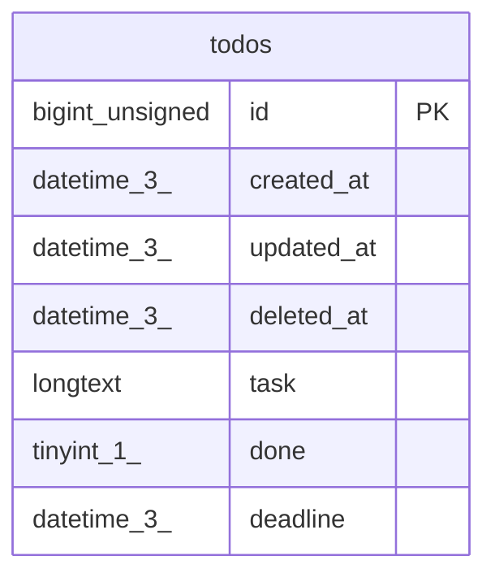

# todos

## Description

<details>
<summary><strong>Table Definition</strong></summary>

```sql
CREATE TABLE `todos` (
  `id` bigint unsigned NOT NULL AUTO_INCREMENT,
  `created_at` datetime(3) DEFAULT NULL,
  `updated_at` datetime(3) DEFAULT NULL,
  `deleted_at` datetime(3) DEFAULT NULL,
  `task` longtext,
  `done` tinyint(1) DEFAULT NULL,
  `deadline` datetime(3) DEFAULT NULL,
  PRIMARY KEY (`id`),
  KEY `idx_todos_deleted_at` (`deleted_at`)
) ENGINE=InnoDB DEFAULT CHARSET=utf8mb4 COLLATE=utf8mb4_0900_ai_ci
```

</details>

## Columns

| Name | Type | Default | Nullable | Extra Definition | Children | Parents | Comment |
| ---- | ---- | ------- | -------- | ---------------- | -------- | ------- | ------- |
| id | bigint unsigned |  | false | auto_increment |  |  |  |
| created_at | datetime(3) |  | true |  |  |  |  |
| updated_at | datetime(3) |  | true |  |  |  |  |
| deleted_at | datetime(3) |  | true |  |  |  |  |
| task | longtext |  | true |  |  |  |  |
| done | tinyint(1) |  | true |  |  |  |  |
| deadline | datetime(3) |  | true |  |  |  |  |

## Constraints

| Name | Type | Definition |
| ---- | ---- | ---------- |
| PRIMARY | PRIMARY KEY | PRIMARY KEY (id) |

## Indexes

| Name | Definition |
| ---- | ---------- |
| idx_todos_deleted_at | KEY idx_todos_deleted_at (deleted_at) USING BTREE |
| PRIMARY | PRIMARY KEY (id) USING BTREE |

## Relations



---

> Generated by [tbls](https://github.com/k1LoW/tbls)
